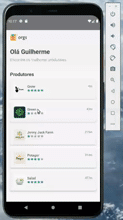

# Orgs Hooks

## How run?

- `yarn or npm install` for install all dependencies
- `yarn start or npm start` for start metro server
- `yarn android or npm run android` for run android application
- `yarn ios or npm run ios` for run ios application
- `yarn test or npm test` for run unit tests
- `yarn lint or npm run lint` for run application linting

## Demo

